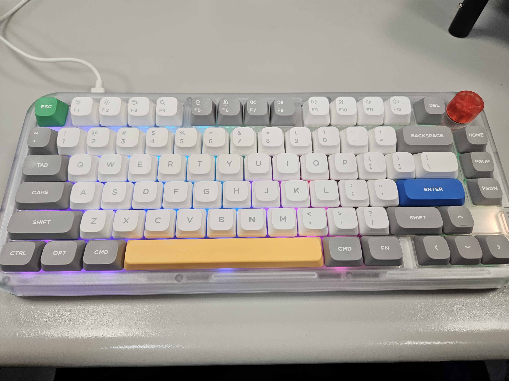

+++
date = '2025-12-29T02:54:44+08:00'
author = "海狸大師"
draft = false
title = '該寫什麼呢？'
categories = ["心情"]
description = '海狸大師在想這個網站到底要寫什麼才好，一個矛盾的心情'
+++

現在時間是凌晨兩點多，因為要改計畫書所以在這邊待了有點久，不過幸好是處理到一個段落了。

週末回家也無法好好休息，即使沒有特別多事情要做，也會因為休息的自己而感到厭煩，算了，這個下次再寫好了，但我到底要寫什麼呀？

上網時，尤其是像 Threads 這類的平台，看到其他人在討論議題我總是想要參一咖，但是又怕因為自己說錯話而被公審。心裡的話其實很多但是沒人可以說，即使有他們也聽不懂，就只有我自己知道，還有這個休息站的人會知道。

聽到一些歌、看到一些影集，都有好多話想說，如果是以前的自己應該會毫不猶豫在社群平台上發表言論，就算是 Instagram 的限時動態也好，但我現在連轉發的勇氣都沒有。雖然已經把大部分 Meta 的平台從手機上移除，但還是會忍不住用瀏覽器滑呀滑，除了讓自己有點不開心，不對，是非常不開心，因為時間也被我滑掉了。重點是：我沒有任何產出。

這邊的產出不一定要是工作、研究上的，而是任何形式的、讓自己舒服的。比方說幫家裡打掃、在廚房做老媽的水腳、寫一首歌、或甚至是在這邊發牢騷，都沒有！！

看到路上神奇的塗鴉、有趣的椅子、殘破不堪的三角錐，我的心裡面其實都會想多說幾句，但是回到家甚至到下一個紅綠燈就忘了，哈。

而且我這個網站也不像是 Facebook 可以用手機發文，幾乎一定要用電腦才能發，雖然在手機也不是不能用 GitHub (咦，搞不好可以試試看喔！)，但就是無法即時記錄，還是說這樣晚上的彙整才是比較好的做法？有沒有心理學大師可以請教一下，喂喂，救救我呀。

不知道是不是因為用 Nuphy kick75 打字特別開心，我總覺得這樣打一打心情就好多了，也可能是我的背景音樂剛剛在放田馥甄的〈影子的影字〉，這些小清新的音樂，像是陳琦貞的音樂，在晚上聽特別有感覺。

好！就這麼決定了，就記錄這些東西吧！這樣自言自語的方式好像也不錯，不知道手邊如果沒有鍵盤要怎麼寫會比較好，寫在手機的 Notion 嗎？好像也不錯，但 Notion 卡卡的，或者是 Samsung Note？也不錯，但重點還是要記錄下來，提醒自己還活著。看到一個是屬於自己的網站有我發牢騷的東東，就覺得很開心，這可能就是經歷過 Y2K 的人們獨有的感受吧，嗎？
